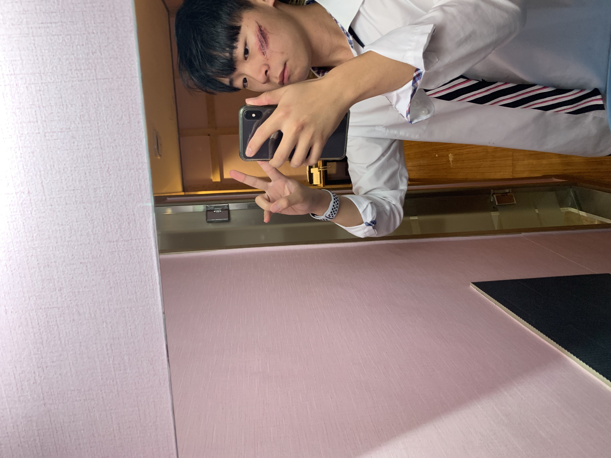

소개
----

# 안녕하세요 김건한 입니다

이름: 김건한

나이 21살

현재 대학생 2학년(2023년 기준)

안녕하세요 저는 21살 청주대학교에 다니고 있는 김건한입니다

저는 현재 ios 개발자를 꿈꾸는 학생이고 지금은 ios관련 산업체에 들어가는 게 목표입니다

아직은 많이 미숙하기에 강의를 보면서 공부하고 공부한 내용을 베이스로 여러 가지 어플을 따라 만들고 있습니다

제가 고2 때부터 코딩을 하면서 느낀 점은 코드는 간결하게 작성해야 좋다는 것입니다

그래서 저는 어플을 따라서 만들고 점차 코드가 간결해지는 일기장(?) 비슷한 것을 만들 겁니다(여기 블로그에)

그러니 처음에는 코드가 엉망일지라도 점차 하루하루 시간이 지날수록 코드가 간결해지고 기능을 추가해 나갈 것입니다

대학교에서 형들이나 누나 분들이 말씀해 주셨습니다 개발자라는 게 쉽지 않다고 그럼에도 저는 개발자가 하고 싶은 이유는 단순히 돈을 잘 벌어서가 아니라 

어렸을 때 코딩을 해봤는데 명령어를 타이핑해서 제가 명령한 게 그대로 어플에 적용된다는 게 저는 너무 재밌었습니다

그래서 그런지 저는 새로운 문법이나 새로운 기술을 공부할때마다 기분이 너무 좋습니다 진짜로 기분이 행복합니다

하지만 계속 도전해도 막히는 부분이나 이해가 안 되는 부분이 분명히 있습니다 그럴 때 저는 카카오톡 오픈 채팅방이나 챗지피티에게 물어보고 이래도 이해가 안 되 었다면

저는 산책을 합니다 뜬금없다고 생각할 수 있지만 저는 생각도 정리하고 다시 공부할 의지를 만드는 데 도움이 되었습니다

그러니깐 혹시 공부하다가 막힌 부분이 있다면 한번 시도해 보세요 저는 도움이 되었으니깐 추천하겠습니다

그리고 막힌 부분이 해결된다면 기분이 너무 좋습니다 ㅠㅠ(참고로 ㅠㅠ는 너무 기분이 좋다고 표현한 것입니당)

지금은 자취를 하고 돈이 조금씩 필요하기에 알바를 하고 있습니다

그래서 이 블로그는 적으면 일주일에 1번 많으면 일주일에 3번을 올릴 수 있을듯합니다 

이 블로그를 보는 사람은 많이 없겠지만 이 블로그를 적는 이유는 제가 성장하는 과정을 기록하고 저 스스로 보고 싶기 때문입니다

이상 김건한 이었습니다

